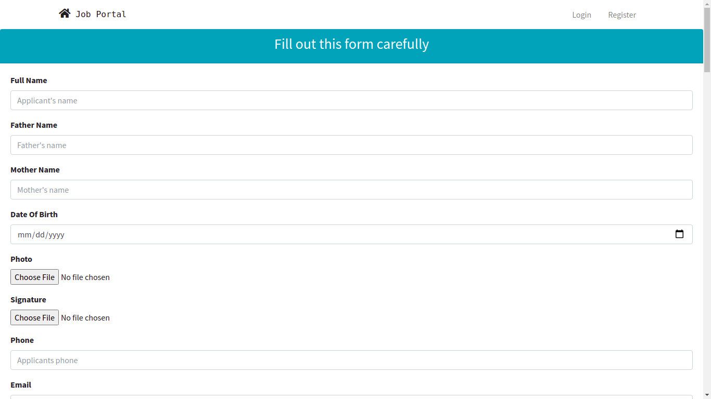
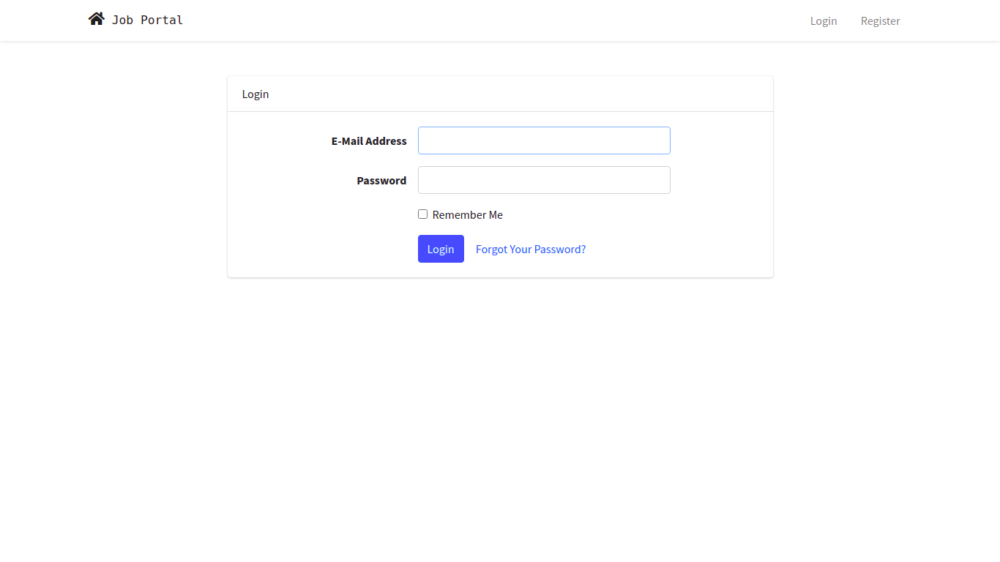
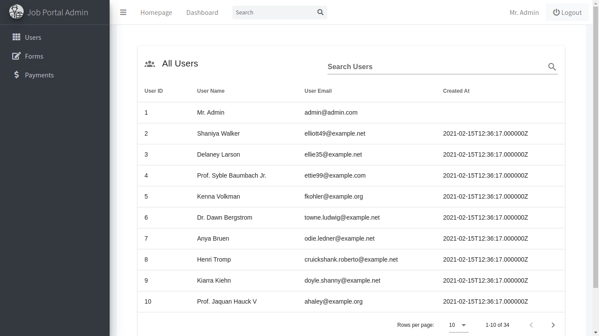
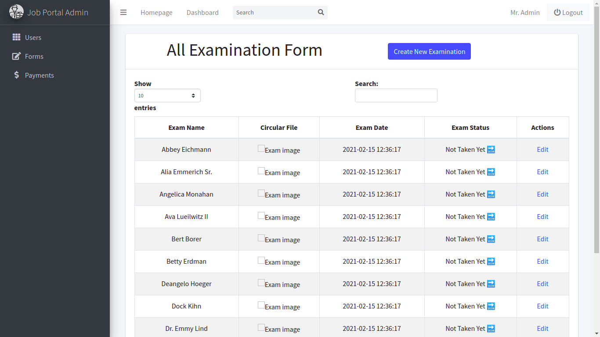
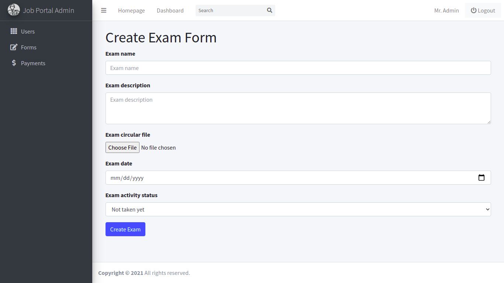
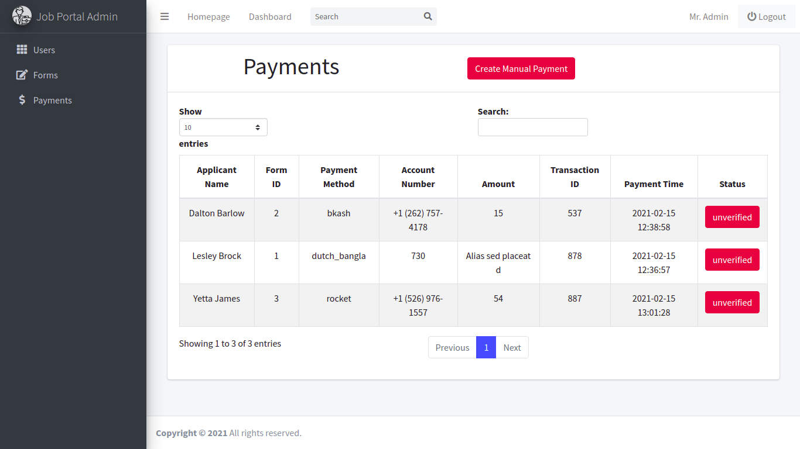

# Job Application Management Software

Job applicants can apply for certain job posts through a descriptive application form. In form, applicant can provide his/her personal and educational information in detail with payments. After submitting the form successfully, applicant get a personal user dashboard panel where he/she get all information related with the process. Administrator of the entire software system also get a dashboard where he can create job form, manage user and application form informations, verify payments manually and so on.

**Prerequisites:**

-   PHP 7.4+
-   Composer
-   MySQL
-   Node JS

**Installing:**

1. Extract the project
2. `cd extacted_project_dir_name`
3. Open up the terminal / bash and run `composer install`
4. Run `cp .env.example .env` or simply rename the `.env.example` file into `.env` and change database connection credentials (host, user-name, password) according to your local settings
5. Run `php artisan migrate --seed` to migrate all migrations and seed default admin and users data.
6. Run `npm install` to install JavaScript related dependencies
7. Run `npm run dev` to compile js / vue files
8. Run `php artisan serve` to serve locally
9. Open up a browser and go to localhost:8000 to access the application front-end

### 📷 Screen-shots

<u>Here are some screen-shots from the application:</u>

